# Loupedeck plugin to control Windows audio

This plugin allows you to control the volume of render and capture devices and display peak meter on each. As well as audio sessions associated with render devices (audio stream between applications and audio endpoint devices).

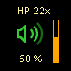

It also allows you to set default communication and multimedia devices and input/output device for each application.

## Installation

- Download the [latest release](https://github.com/insideGen/Loupedeck-AudioControl-OpenPlugin/releases/latest) of the `.lplug4` asset;
- Double-click on the file and follow the instructions in the Loupedeck application.

Only available for Windows, tested with Loupedeck Live S.

## Actions

### Audio touch action [Command]

Displays volume and peak meter and allows volume control.

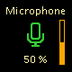
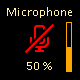
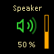
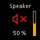

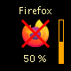

**`Configuration`**

| Parameter | Type    | Value                        | Description                                                                                                                                                                                  |
| --------- | ------- | ---------------------------- | -------------------------------------------------------------------------------------------------------------------------------------------------------------------------------------------- |
| Type      | Listbox | Capture, Render, Application | Capture and Render: lists all active devices. Application: lists all running apps currently emitting sound.                                                                                  |
| Endpoint  | Listbox | *                            | Endpoint name. **Default communications** and **Default multimedia** are dynamic endpoints for Capture and Render type. **Foreground application** is dynamic endpoint for Application type. |
| Channel   | Listbox | None, A, B, C                | Channel allows to bind this `Audio touch action` to an `Audio encoder action`.                                                                                                               |

**`Touch screen`**

| Gesture    | Description                                                                                                               |
| ---------- | ------------------------------------------------------------------------------------------------------------------------- |
| Single tap | Select the endpoint for the channel defined in the configuration if Channel is not set to None, otherwise nothing.        |
| Double tap | Mute/unmute endpoint defined in the configuration.                                                                        |
| Long press | Mute/unmute all endpoint of this type (Capture, Render or Application) defined in the configuration.                      |

### Audio encoder action [Adjustment with reset]

Displays volume and peak meter and allows volume control.

**`Configuration`**

| Parameter | Type    | Value                        | Description                                                                                                                                                                                  |
| --------- | ------- | ---------------------------- | -------------------------------------------------------------------------------------------------------------------------------------------------------------------------------------------- |
| Type      | Listbox | Capture, Render, Application | Capture and Render: lists all active devices. Application: lists all running apps currently emitting sound.                                                                                  |
| Endpoint  | Listbox | *                            | Endpoint name. **Default communications** and **Default multimedia** are dynamic endpoints for Capture and Render type. **Foreground application** is dynamic endpoint for Application type. |
| Channel   | Listbox | None, A, B, C                | Channel allows to bind this `Audio encoder action` to multiple `Audio touch action`.                                                                                                         |

**`Dial`**

| Gesture    | Description                                                                                                               |
| ---------- | ------------------------------------------------------------------------------------------------------------------------- |
| Rotate     | Adjust volume of endpoint selected in channel if Channel is not set to None, otherwise endpoint defined in configuration. |
| Push       | Mute/unmute endpoint selected in channel if Channel is not set to None, otherwise endpoint defined in configuration.      |

### Mute/unmute all capture devices [Command]

Allows to mute/unmute all capture devices.

**`Touch screen`**

| Gesture    | Description                          |
| ---------- | ------------------------------------ |
| Single tap | Mute all capture devices.            |
| Long press | Unmute all capture devices.          |

### Mute/unmute all render devices [Command]

Allows to mute/unmute all render devices.

**`Touch screen`**

| Gesture    | Description                          |
| ---------- | ------------------------------------ |
| Single tap | Mute all render devices.             |
| Long press | Unmute all render devices.           |

### All-in-one [Folder]

Gathers all the folders.

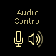

#### Sub-folders

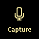
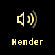

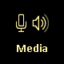
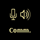

- Capture devices
- Render devices
- Applications
- Multimedia (Multimedia capture device + Multimedia render device + Applications)
- Communication (Communication capture device + Communication render device + Applications)
- Settings

### Capture devices [Folder]

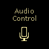

#### Capture devices page

Displays all active capture devices and their peak meters (display peak meter only when an audio stream exists).

**`Touch screen`**

| Gesture    | Description                          |
| ---------- | ------------------------------------ |
| Single tap | Select the device.                   |
| Double tap | Mute/unmute device.                  |
| Swipe up   | Set device as default communication. |
| Swipe down | Set device as default multimedia.    |

**`Dial`**

| Gesture    | Description                          |
| ---------- | ------------------------------------ |
| Rotate     | Adjust selected device volume.       |
| Push       | Mute/unmute selected device.         |

### Render devices [Folder]

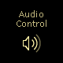

#### Render devices page

Displays all active render devices and their peak meters.

**`Touch screen`**

| Gesture    | Description                          |
| ---------- | ------------------------------------ |
| Single tap | Select the device.                   |
| Double tap | Mute/unmute device.                  |
| Swipe up   | Set device as default communication. |
| Swipe down | Set device as default multimedia.    |
| Long press | Open render applications page.       |

**`Dial`**

| Gesture    | Description                          |
| ---------- | ------------------------------------ |
| Rotate     | Adjust selected device volume.       |
| Push       | Mute/unmute selected device.         |

#### Render applications page

Displays all active applications of a specific render device and their peak meters.

**`Touch screen`**

| Gesture    | Description                          |
| ---------- | ------------------------------------ |
| Single tap | Select the application.              |
| Double tap | Mute/unmute application.             |
| Long press | Open input/output device page.       |

**`Dial`**

| Gesture    | Description                          |
| ---------- | ------------------------------------ |
| Rotate     | Adjust selected application volume.  |
| Push       | Mute/unmute selected application.    |

#### Input/output device page

Configure input/output device for application.

### Applications [Folder]

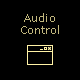

#### Applications page

Displays all active applications and their peak meters.

**`Touch screen`**

| Gesture    | Description                          |
| ---------- | ------------------------------------ |
| Single tap | Select the application.              |
| Double tap | Mute/unmute application.             |
| Long press | Open input/output device page.       |

**`Dial`**

| Gesture    | Description                          |
| ---------- | ------------------------------------ |
| Rotate     | Adjust selected application volume.  |
| Push       | Mute/unmute selected application.    |

#### Input/output device page

Configure input/output device for application.

### Settings [Folder]

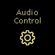

#### Settings page

| Setting           | Value               | Description                                                                          |
| ----------------- | ------------------- | ------------------------------------------------------------------------------------ |
| FPS               | 10, **20**, 30      | Select refresh rate (impacts the smoothness of the peak meter and processor usage).  |
| Peak meter        | **Yes**, No         | Enable/disable peek meter.                                                           |
| Device icon style | **Windows**, Custom | Switch between Windows icon style and custom icons.                                  |
| Folder decoration | Yes, **No**         | Enable/disable folder icon decoration (a restart is required to apply this setting). |
| Blue light filter | **Yes**, No         | Enable/disable blue light filter (a restart is required to apply this setting).      |

*Default values are highlighted in bold.*
